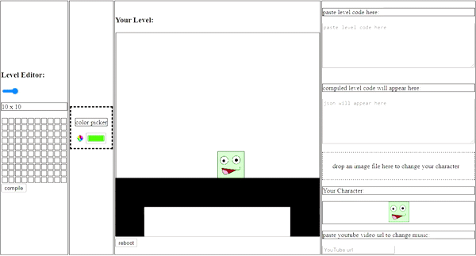

# HTML Level Maker 🎨

> A website for creating 2D platformer levels!

[][demo_url]

Check out the [demo][demo_url]!

## About

This website was written with JavaScript in early 2018.
The idea of creating the levels for simple platformers, such as the [original Super Mario][smb1_info], filled me with pleasant emotions.
In the attempt of experiencing this for myself, I decided to create this project.

---

Created with 💖 by [EthanThatOneKid][author_url]

[smb1_info]: https://en.wikipedia.org/wiki/Super_Mario_Bros.
[demo_url]: https://ethanthatonekid.github.io/html-level-maker/
[author_url]: https://github.com/EthanThatOneKid/